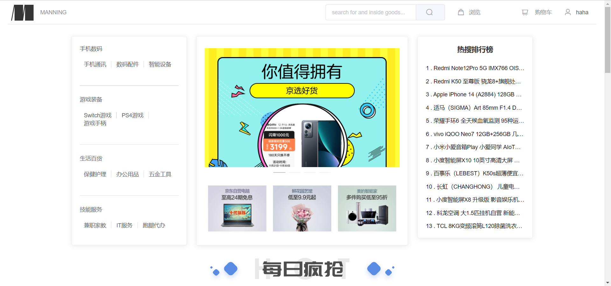
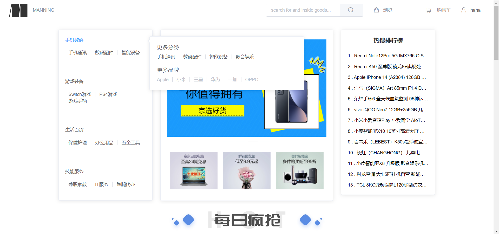
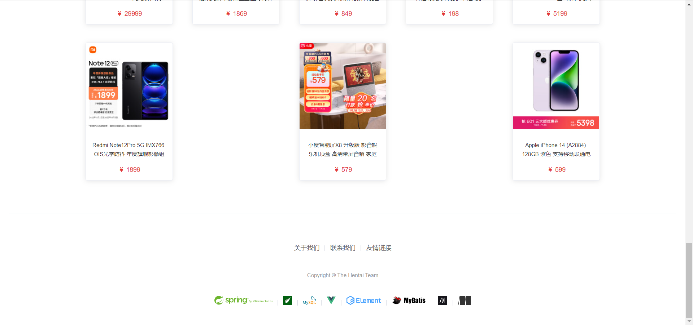
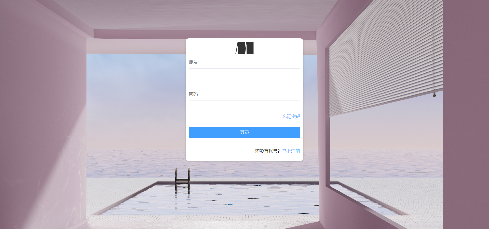
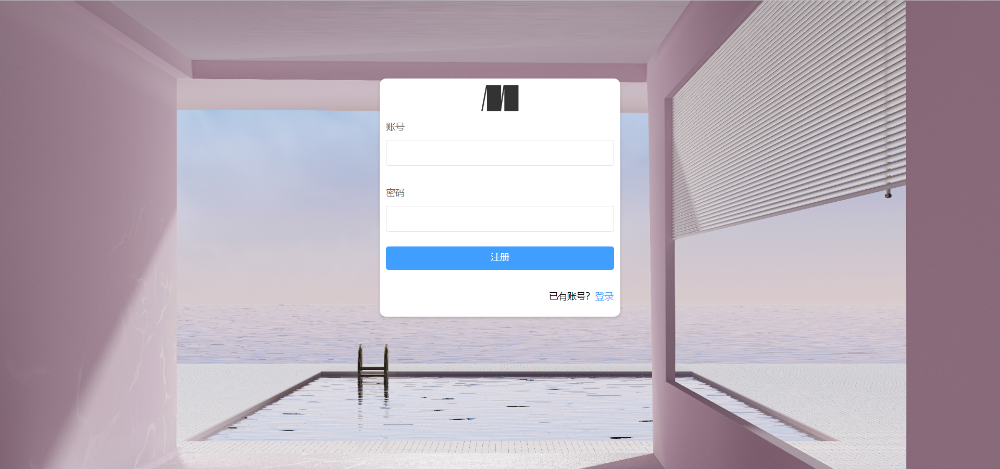
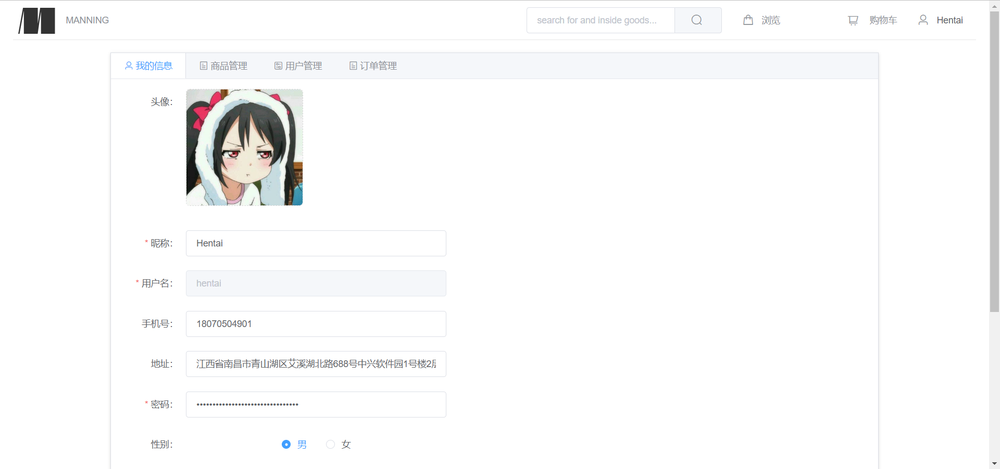
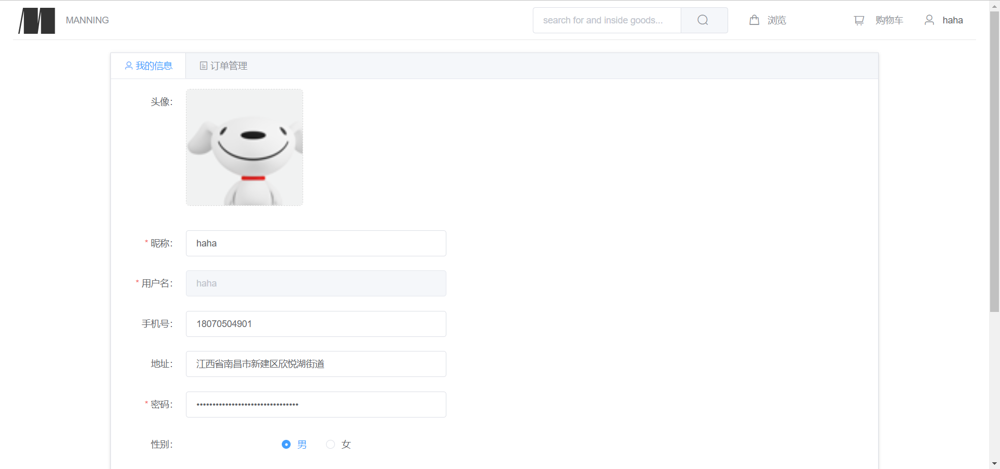
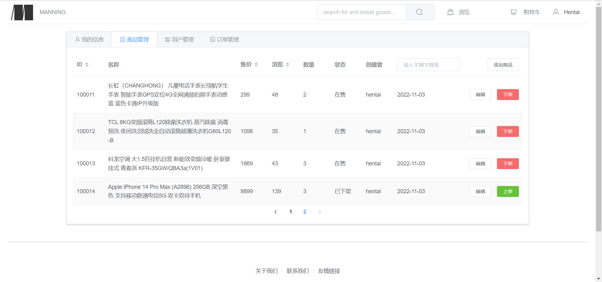
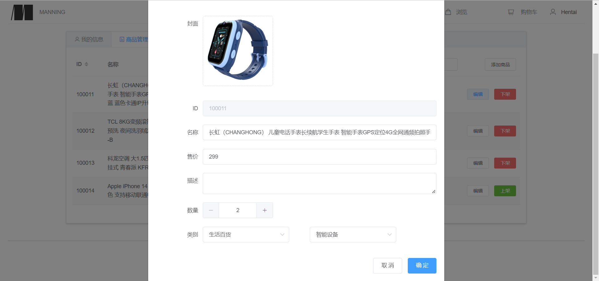

# ssm-helloworld

Java版本：1.8   
数据库：MySQL 5.7   
框架：Spring + Spring MVC + MyBatis  
服务器：Tomcat  
前端解析框架：Thymeleaf + Element-UI    
开发工具：IntelliJ IDEA 2022.1.2

### 2.1 效果预览

#### 2.1.1 首页

### 2.1.2 登录注册

### 2.1.3 个人中心

> 管理员的个人中心

> 普通用户的个人中心

